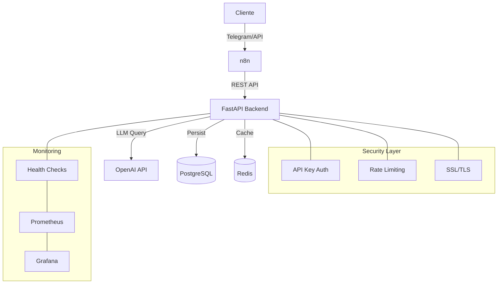

# 🧠 AI Personal Workflow Assistant

<div align="center">
  
  
  
  
  
  
</div>

<p align="center">
  
</p>

> Sistema de automatización inteligente que integra IA para procesar y automatizar tareas usando FastAPI, n8n y OpenAI, permitiendo resúmenes, traducciones y clasificación de textos a través de una interfaz de Telegram o API REST.
<p align="center">
  
</p>
## 🎯 Características Principales

- 📝 **Procesamiento de Texto Inteligente**:
  - Resumen automático de textos largos (artículos, reportes, documentos)
  - Traducción multilingüe con preservación de contexto (optimizado para ES-EN)
  - Clasificación de contenido, urgencia e intención

- 🤖 **Integración Multi-Canal**:
  - Bot de Telegram nativo para interacción conversacional
  - API REST para integración con sistemas externos
  - Webhooks para automatización basada en eventos

- ⚡ **Arquitectura de Alto Rendimiento**:
  - Sistema de caché Redis para respuestas frecuentes (hasta 95% más rápido)
  - Backend asíncrono end-to-end para máxima concurrencia
  - Optimización con pool de conexiones a PostgreSQL
  - Modelo de reintentos automáticos con backoff exponencial
  - Manejo robusto de errores con códigos HTTP específicos

- 🔐 **Seguridad Enterprise**:
  - Autenticación basada en API Keys
  - Soporte SSL/TLS para comunicaciones cifradas
  - Sanitización automática de datos sensibles en logs
  - Contenedores Docker con usuario no-root

- 📊 **Analítica y Monitoreo**:
  - Trazabilidad completa de operaciones
  - Métricas de rendimiento y uso
  - Visualización en tiempo real con Prometheus/Grafana (opcional)
  - Registro detallado y estructurado de eventos

## 📊 Vista General de la Arquitectura



## 🚀 Inicio Rápido

### 1. Requisitos Previos
- Docker y Docker Compose
- Acceso a internet para descargar imágenes
- OpenAI API Key para procesamiento IA
- Telegram Bot Token (opcional, para integración con Telegram)
- 2GB RAM mínimo, 4GB recomendado

### 2. Instalación

```bash
# Clonar el repositorio
git clone https://github.com/dasafo/AI-Workflow-Assistant.git
cd AI-Workflow-Assistant

# Configurar variables de entorno
cp .env.example .env
nano .env

# Iniciar servicios
make up

# Verificar que todo funciona correctamente
make health-check
```

### 3. Configuración de Variables Esenciales

Edita el archivo `.env` con la siguiente información mínima:

```bash
# API Key para el backend (generar una segura)
API_KEY=tu_api_key_segura

# OpenAI API Key (https://platform.openai.com/api-keys)
OPENAI_API_KEY=sk-...

# Configuración de Telegram (opcional)
TELEGRAM_BOT_TOKEN=123456:ABC-DEF1234ghIkl-zyx57W2v1u123ew11
WEBHOOK_URL=https://tu-dominio.com/webhook

# Redis y PostgreSQL (puedes dejar valores por defecto para desarrollo local)
POSTGRES_PASSWORD=password_segura
REDIS_HOST=redis
```

## 💼 Ideas de Aplicación

Estas son algunas posibilidades que podrías implementar con AI Workflow Assistant:

### 💼 Productividad Ejecutiva

<p align="center">
  
</p>

**¿Y si pudieras...?**
- Recibir resúmenes automáticos de correos largos al instante
- Clasificar la urgencia de solicitudes entrantes automáticamente
- Obtener traducciones de correspondencia internacional preservando el contexto empresarial

```bash
# Un ejecutivo podría simplemente enviar:
/resumir [correo extenso]

# Y recibir instantáneamente:
> "Reunión el martes con marketing. Necesitan aprobación del presupuesto Q3. Presentación adjunta."
```

### 🔬 Conocimiento Técnico

<p align="center">
  
</p>

**Imagina poder:**
- Tener toda tu documentación técnica resumida y clasificada automáticamente
- Hacer disponible la misma información en múltiples idiomas sin esfuerzo
- Permitir búsquedas en lenguaje natural sobre tu base de conocimiento

```bash
# Un equipo técnico podría consultar:
curl -X POST http://localhost:8000/api/v1/procesar \
  -H "x-api-key: ${API_KEY}" \
  -d '{
    "chat_id": 123456,
    "texto": "The system employs a multi-tier architecture...",
    "tipo_tarea": "traducir"
  }'

# Obteniendo inmediatamente la versión localizada
```

### 📊 Inteligencia de Negocio

<p align="center">
  
</p>

**¿Te gustaría...?**
- Analizar el sentimiento de los comentarios de clientes automáticamente
- Detectar tendencias emergentes en las opiniones recibidas
- Priorizar incidencias según su impacto potencial en el negocio

```bash
# Este análisis podría realizarse con:
curl -X POST http://localhost:8000/api/v1/procesar \
  -H "x-api-key: ${API_KEY}" \
  -d '{
    "chat_id": 123456, 
    "texto": "La aplicación se cierra al abrir PDFs...",
    "tipo_tarea": "clasificar"
  }'

# Facilitando decisiones informadas sobre prioridades
```

## 📡 Guía API Completa

### Principales Endpoints

#### 1. Gestión de Estado de Usuario
```bash
curl -X POST http://localhost:8000/api/v1/estado \
  -H "Content-Type: application/json" \
  -H "x-api-key: ${API_KEY}" \
  -d '{
    "chat_id": 123456,
    "modo": "/resumir"
  }'
```

#### 2. Procesamiento de Texto
```bash
curl -X POST http://localhost:8000/api/v1/procesar \
  -H "Content-Type: application/json" \
  -H "x-api-key: ${API_KEY}" \
  -d '{
    "chat_id": 123456,
    "texto": "Tu texto largo aquí para procesar según el modo activo o el tipo_tarea especificado",
    "tipo_tarea": "resumir"
  }'
```

#### 3. Consulta Inteligente de Historial
```bash
curl -X POST http://localhost:8000/api/v1/consultar-inteligente \
  -H "Content-Type: application/json" \
  -H "x-api-key: ${API_KEY}" \
  -d '{
    "chat_id": 123456,
    "texto": "Muéstrame mis últimas traducciones"
  }'
```

#### 4. Consulta Directa de Historial
```bash
curl -X POST http://localhost:8000/api/v1/consultar \
  -H "Content-Type: application/json" \
  -H "x-api-key: ${API_KEY}" \
  -d '{
    "chat_id": 123456,
    "tipo_tarea": "traducir",
    "limit": 5
  }'
```

### Endpoints Adicionales

#### Health Check
```bash
curl http://localhost:8000/health
```

## 🔧 Comandos Esenciales

```bash
# Ver todos los comandos disponibles
make help

# Iniciar todos los servicios
make up

# Verificar estado de servicios
make ps

# Ver logs en tiempo real
make logs

# Acceder a la base de datos
make db

# Ejecutar tests
make test

# Detener servicios
make down

# Reconstruir servicios después de cambios
make build

# Limpiar archivos temporales y caché
make clean
```

## 🛠️ Herramientas de Administración

### pgAdmin - Interfaz web para PostgreSQL

El proyecto incluye pgAdmin, una interfaz web completa para administrar la base de datos PostgreSQL:

- **Acceso**: http://localhost:8081
- **Credenciales por defecto**: 
  - Email: admin@admin.com
  - Password: admin

Para conectar a la base de datos:
1. Accede a pgAdmin en tu navegador
2. Crea una nueva conexión con:
   - Host: postgres (nombre del servicio en Docker)
   - Port: 5432
   - Database: workflowdb (o el valor de POSTGRES_DB en tu .env)
   - Username: david (o el valor de POSTGRES_USER en tu .env)
   - Password: (el valor de POSTGRES_PASSWORD en tu .env)

Esta interfaz te permite:
- Explorar tablas y relaciones
- Ejecutar queries SQL
- Visualizar y editar registros
- Exportar datos
- Monitorear el rendimiento

## 🧩 Integración con n8n

<p align="center">
  
</p>

El sistema incluye flujos pre-configurados para n8n que puedes importar:

1. Accede a n8n en http://localhost:5678
2. Usa los archivos en la carpeta `n8n-flows/`
3. Configura las credenciales necesarias:
   - HTTP Node: URL del backend y API Key
   - Telegram: Bot Token si usas la integración

### Ejemplos de Flujos Incluidos:

- **telegram-bot.json**: Bot completo con comandos /resumir, /traducir y /clasificar
- **periodic-reports.json**: Generación automática de informes y envío por email
- **content-monitor.json**: Monitoreo de URLs y notificación de cambios

## 🛠️ Arquitectura Detallada

El sistema sigue una arquitectura de microservicios, con componentes desacoplados que se comunican a través de interfaces bien definidas:

| Componente | Tecnología | Función |
|------------|------------|---------|
| **Backend Core** | FastAPI | Punto de entrada API, validación, autenticación |
| **Gestión de Estados** | Python Async | Manejo de modos de usuario y contexto de conversación |
| **Procesamiento de Tareas** | Python Async | Resumir, traducir y clasificar textos |
| **Caché** | Redis | Almacenamiento en memoria para respuestas frecuentes |
| **Base de Datos** | PostgreSQL | Persistencia de datos, histórico y trazabilidad |
| **Flujos** | n8n | Orquestación de procesos, integración de canales |
| **Procesamiento IA** | OpenAI API | Motor de inteligencia artificial |

### Flujo de Datos
1. Petición recibida (API o n8n)
2. Validación y autenticación
3. Verificación en caché (si aplica)
4. Procesamiento con servicio específico según el tipo de tarea
5. Llamada a OpenAI si es necesario
6. Persistencia en base de datos (modelo unificado ConsultaIA)
7. Respuesta al cliente

### Modelo de Datos Simplificado
La aplicación utiliza un modelo de datos unificado para todas las consultas de IA:

- **ConsultaIA**: Almacena todas las consultas (resúmenes, traducciones, clasificaciones)
  - `chat_id`: Identificador del chat/usuario
  - `tipo_tarea`: Tipo de tarea realizada (resumir, traducir, clasificar)
  - `texto_original`: Texto enviado para procesar
  - `resultado`: Resultado de la operación
  - `idioma`: Solo para traducciones
  - `fecha`: Timestamp de la consulta

- **EstadoUsuario**: Mantiene el estado/modo actual del usuario
  - `chat_id`: Identificador del chat/usuario
  - `modo_actual`: Modo activo (/resumir, /traducir, etc.)

## 📂 Estructura del Proyecto Actualizada
```
AI-Workflow-Assistant/
├── backend/
│   ├── api/
│   │   ├── routes/
│   │   │   ├── __init__.py
│   │   │   └── router.py       # Router principal
│   │   ├── workflow_endpoints.py # Endpoints principales
│   │   └── schemas.py         # Esquemas Pydantic
│   ├── core/
│   │   ├── cache.py           # Sistema de caché Redis
│   │   ├── errors.py          # Manejo de errores y excepciones globales
│   │   ├── health.py          # Health checks
│   │   ├── logging.py         # Configuración de logs
│   │   └── retry.py           # Sistema de reintentos
│   ├── services/
│   │   ├── db.py              # Gestión de base de datos unificada
│   │   ├── models.py          # Modelos SQLAlchemy (ConsultaIA, EstadoUsuario)
│   │   └── tasks/             # Implementación específica de tareas
│   │       ├── summarize.py   # Servicio de resumen
│   │       ├── translate.py   # Servicio de traducción
│   │       └── classify.py    # Servicio de clasificación
│   ├── migrations/            # Migraciones de base de datos
│   └── main.py                # Punto de entrada de la aplicación
├── docs/
│   ├── GUIDE.md               # Guía técnica completa
│   └── workflow.md            # Documentación de arquitectura
├── n8n-flows/                 # Flujos exportados de n8n
└── docker/                    # Configuraciones Docker
├── cleanup.sh                 # Script para limpieza de archivos temporales
```

## 📊 Monitoreo y Mantenimiento

El sistema incluye herramientas para monitoreo y mantenimiento:

- **Health Checks**: Endpoint `/health` para verificar estado de componentes
- **Logs Estructurados**: Formato JSON para fácil integración con ELK/Loki
- **Manejo de Errores**: Tratamiento específico de errores de OpenAI API
  - Timeouts: Código 504
  - Rate limits: Código 429
  - Errores generales de API: Código 502
- **Métricas Prometheus**: Exposición de métricas de rendimiento (opcional)
- **Dashboards Grafana**: Visualización pre-configurada (opcional)
- **Backups Automáticos**: Scripts para backup de datos y configuración

### Alertas Recomendadas
- Errores 5xx > 1% de peticiones
- Latencia > 1000ms en percentil 95
- Uso de CPU > 80% por más de 5 minutos
- Espacio en disco < 15%

## 🔐 Seguridad

El sistema implementa múltiples capas de seguridad:

- **Autenticación**: API Keys con rotación recomendada cada 90 días
- **Network**: Servicios en red Docker aislada, mínima exposición
- **Datos**: Sanitización de entradas, validación Pydantic
- **Contenedores**: Imágenes Alpine mínimas, usuario no-root
- **Secretos**: Variables de entorno en archivos .env (no hardcoded)
- **SSL/TLS**: Configuración HTTPS con certificados renovados automáticamente

## 🔍 Guía de Resolución de Problemas

### Problemas Comunes y Soluciones

| Problema | Solución |
|----------|----------|
| **Error de conexión a Redis** | Verificar que el servicio está corriendo: `docker ps \| grep redis` |
| **Fallos en API OpenAI** | Comprobar límites de cuota y validez de API Key, revisar errores 429/504 |
| **n8n no se conecta al backend** | Verificar URL y API Key en configuración de HTTP Request |
| **Telegram no responde** | Comprobar Webhook URL y token del bot en las variables de entorno |
| **Lentitud en respuestas** | Revisar logs por posibles timeouts o aumentar recursos de contenedores |

Para más asistencia, consulta la [documentación completa](docs/GUIDE.md) o abre un issue en GitHub.

## 📚 Documentación

- [Guía Técnica Completa](docs/GUIDE.md)
- [Documentación de Arquitectura](docs/workflow.md)
- [API Docs (OpenAPI)](http://localhost:8000/docs)
- [n8n Dashboard](http://localhost:5678)

## 🚀 Recursos Adicionales

- [Video Demo](https://youtube.com/example) - Demostración completa del sistema
- [Slides de Presentación](https://slideshare.net/example) - Presentación para equipos técnicos
- [Artículo Técnico](https://medium.com/example) - Detalles de implementación y arquitectura

## 🤝 Contribuir

Las contribuciones son bienvenidas y apreciadas. Para contribuir:

1. Fork el proyecto
2. Crea tu rama (`git checkout -b feature/AmazingFeature`)
3. Commit tus cambios (`git commit -m 'Add: AmazingFeature'`)
4. Push a la rama (`git push origin feature/AmazingFeature`)
5. Abre un Pull Request

Por favor, asegúrate de seguir nuestras [guías de contribución](CONTRIBUTING.md) y [código de conducta](CODE_OF_CONDUCT.md).

## 📄 Licencia

Este proyecto está licenciado bajo la Licencia MIT - ver el archivo [LICENSE](LICENSE) para más detalles.

## 👤 Autor

**David Salas**
- Website: [dasafodata.com](https://dasafodata.com)
- GitHub: [@dasafo](https://github.com/dasafo)
- LinkedIn: [David Salas](https://www.linkedin.com/in/dasafodata/)

---

<p align="center">
  <sub>Creado con ❤️ por David Salas - dasafodata</sub>
</p>