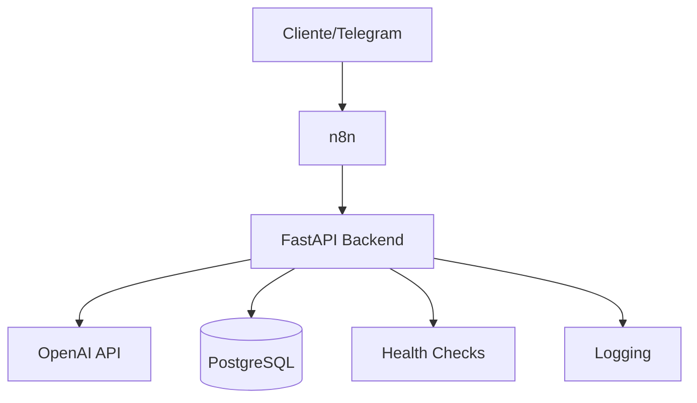

# 🧠 AI Personal Workflow Assistant

> Sistema de automatización inteligente que integra IA para procesar y automatizar tareas usando FastAPI, n8n y OpenAI, permitiendo resúmenes, traducciones y clasificación de textos a través de una interfaz de Telegram.

## 🎯 Características Principales

- 📝 Resumen automático de textos largos
- 🔄 Traducción multilingüe (ES/EN)
- 🏷️ Clasificación de contenido e intención
- 📱 Bot de Telegram integrado
- 📊 Persistencia en PostgreSQL
- 🔐 Seguridad y autenticación
- 🐳 Containerización completa

## 🛠️ Stack Tecnológico

| Tecnología | Versión | Propósito |
|------------|---------|-----------|
| FastAPI | 0.104.1 | Backend API REST con protocolo MCP |
| n8n | latest | Orquestación de workflows y bot Telegram |
| PostgreSQL | 14-alpine | Persistencia y trazabilidad |
| OpenAI | gpt-4o-mini-2024-07-18 | Motor de procesamiento IA |
| Docker | 24.0+ | Containerización y orquestación |
| Python | 3.11 | Lenguaje base del backend |

## 📊 Arquitectura


```mermaid
graph TD
    A[Cliente/Telegram] --> B[n8n]
    B --> C[FastAPI Backend]
    C --> D[OpenAI API]
    C --> E[(PostgreSQL)]
    C --> F[Health Checks]
    C --> G[Logging]
```

## 🚀 Inicio Rápido

1. **Requisitos Previos**
```bash
# Instalar Docker y Make
sudo apt install docker.io docker-compose make
```

2. **Clonar y Preparar**
```bash
git clone https://github.com/dasafo/AI-Workflow-Assistant.git
cd AI-Workflow-Assistant
cp .env.example .env
```

3. **Configurar Variables**
```bash
# Edita las variables de entorno
nano .env

# Variables requeridas:
# - API_KEY: Clave para autenticación
# - OPENAI_API_KEY: Clave de API de OpenAI
# - POSTGRES_*: Configuración de base de datos
# - N8N_*: Configuración de n8n y webhooks
```

4. **Ejecutar Servicios**
```bash
make up            # Inicia todos los servicios
make logs         # Muestra logs en tiempo real
make ps           # Lista contenedores activos
```

## 📡 Endpoints API

### Resumen de Texto
```bash
curl -X POST http://localhost:8000/api/v1/mcp/invoke \
  -H "Content-Type: application/json" \
  -H "x-api-key: ${API_KEY}" \
  -d '{
    "task": "summarize",
    "input": {"text": "Tu texto aquí..."},
    "context": {"user_id": "test_user"}
  }'
```

### Traducción
```bash
curl -X POST http://localhost:8000/api/v1/mcp/invoke \
  -H "Content-Type: application/json" \
  -H "x-api-key: ${API_KEY}" \
  -d '{
    "task": "translate",
    "input": {
      "text": "Hello world",
      "lang": "es"
    }
  }'
```

## 📂 Estructura del Proyecto
```
AI-Workflow-Assistant/
├── backend/
│   ├── api/          # Endpoints y rutas
│   │   └── routes/
│   │       └── router.py
│   ├── core/         # Componentes centrales
│   │   ├── schemas.py   # Modelos Pydantic
│   │   ├── models.py    # Modelos SQLAlchemy
│   │   ├── logging.py   # Logging centralizado
│   │   └── health.py    # Health checks
│   └── services/     # Lógica de negocio
│       ├── db.py
│       └── tasks/    # Servicios de IA
├── n8n-flows/       # Flujos de n8n
└── docker/         # Config Docker
```

## 🔄 Flujo de Trabajo
1. Usuario envía comando al bot de Telegram
2. n8n procesa y valida el comando
3. Backend autentica y procesa con IA
4. Resultado se guarda en PostgreSQL
5. Respuesta retorna al usuario

## 🛡️ Características de Seguridad
- API Key validation
- Logging centralizado
- Health checks unificados
- Variables de entorno centralizadas
- Usuario no-root en contenedores
- HTTPS para webhooks
- Autenticación básica en n8n

## 🤖 Comandos de Telegram

- `/resumir [texto]`: Genera un resumen conciso
- `/traducir [texto]`: Traduce entre ES/EN
- `/clasificar [texto]`: Analiza el tipo de contenido

## 🛠️ Comandos de Desarrollo

```bash
make help          # Lista todos los comandos
make up           # Inicia servicios
make down         # Detiene servicios
make restart      # Reinicia servicios
make logs         # Muestra logs
make test         # Ejecuta tests
make db           # Accede a PostgreSQL
```

## 🔐 Seguridad

- Autenticación mediante API Key
- Variables de entorno seguras
- Contenedores con usuario no-root
- Healthchecks en todos los servicios
- HTTPS para webhooks
- Autenticación básica en n8n

## 📚 Documentación

- [Guía Técnica](docs/GUIDE.md)
- [API Docs](http://localhost:8000/docs)
- [n8n Dashboard](http://localhost:5678)

## 🤝 Contribuir

1. Fork el proyecto
2. Crea tu rama (`git checkout -b feature/AmazingFeature`)
3. Commit tus cambios (`git commit -m 'Add: AmazingFeature'`)
4. Push a la rama (`git push origin feature/AmazingFeature`)
5. Abre un Pull Request

## 📄 Licencia

MIT © David Salas

## 👤 Autor

**David Salas**
- Website: [dasafodata.com](https://dasafodata.com)
- GitHub: [@dasafo](https://github.com/dasafo)