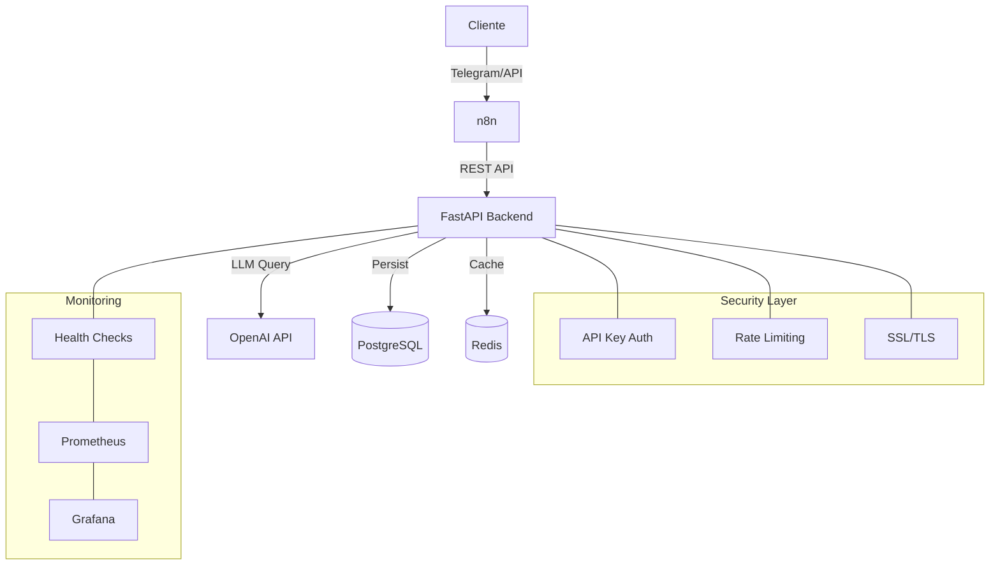

# 🧠 AI Workflow Assistant - Documentación Técnica Completa

## 🎯 Descripción General
Sistema de automatización inteligente que integra IA para procesar y automatizar tareas usando FastAPI, n8n y OpenAI. Diseñado como una solución modular y extensible, permite a las organizaciones implementar flujos de trabajo asistidos por IA con mínima configuración.

## 🏗️ Arquitectura Principal

### 1. Backend (FastAPI)
- Implementa API RESTful con autenticación API Key
- Maneja tres tareas principales:
  - `resumir`: Resúmenes automáticos de texto utilizando GPT-4o-mini
  - `traducir`: Traducción entre idiomas con detección automática y optimización para pares ES-EN
  - `clasificar`: Clasificación de contenido, urgencia e intención
- Sistema de gestión de estados de usuario para contexto de conversaciones
- Sistema de caché Redis para optimizar respuestas repetidas (implementado en todos los endpoints)
- Persistencia en PostgreSQL en tabla unificada `consultas_ia` para histórico y trazabilidad
- Arquitectura completamente asíncrona para máximo rendimiento
- Manejo robusto de errores con códigos HTTP específicos:
  - 504 para timeouts de conexión a OpenAI
  - 429 para límites de tasa excedidos
  - 502 para errores generales de la API

### 2. Orquestación (n8n)
- Maneja flujos de trabajo automatizados sin código
- Integración con Telegram para recibir comandos y enviar respuestas
- Webhooks para comunicación con sistemas externos
- Procesamiento condicional basado en clasificación de contenido
- Sistema de plantillas para respuestas personalizadas

### 3. Base de Datos (PostgreSQL)
- Esquema unificado con tabla principal `consultas_ia`
- Índices estratégicos para mejorar velocidad de búsqueda
- Restricciones de integridad para evitar duplicados
- Almacena:
  - Historial completo de consultas (resúmenes, traducciones, clasificaciones)
  - Estado actual de los usuarios (modo de conversación)
  - Metadatos adicionales para analítica

### 4. Sistema de Caché (Redis)
- Almacenamiento en memoria para respuestas frecuentes
- TTL configurable por tipo de tarea (24 horas por defecto)
- Implementado mediante decorador `@cache_response` en todos los servicios
- Reducción significativa de costos de API de OpenAI
- Mejora de tiempos de respuesta (hasta 95% más rápido para respuestas cacheadas)

## 📋 API REST Implementada

El sistema implementa una API REST completa con los siguientes endpoints principales:

### 1. Endpoint de Estado `/api/v1/estado`

Gestiona el estado o modo actual de un usuario, útil para el contexto de conversación en bots de Telegram.

#### Ejemplo de Petición:
```json
{
  "chat_id": 123456789,
  "modo": "/resumir"
}
```

#### Ejemplo de Respuesta:
```json
{
  "chat_id": 123456789,
  "modo_actual": "/resumir",
  "mensaje": "¿Qué texto quieres resumir?",
  "success": true
}
```

### 2. Endpoint de Procesamiento `/api/v1/procesar`

Procesa texto según la tarea solicitada (resumir, traducir, clasificar) o el modo activo del usuario. Si no se especifica `tipo_tarea`, intentará obtenerlo del estado guardado del usuario en la base de datos.

#### Ejemplo de Petición:
```json
{
  "chat_id": 123456789,
  "texto": "The system architecture includes a distributed database with sharding capabilities for horizontal scaling and improved availability across regions.",
  "tipo_tarea": "traducir"
}
```

#### Ejemplo de Respuesta:
```json
{
  "chat_id": 123456789,
  "resultado": "La arquitectura del sistema incluye una base de datos distribuida con capacidades de sharding para escalado horizontal y disponibilidad mejorada entre regiones.",
  "tipo_tarea": "traducir",
  "success": true,
  "mensaje": "Procesamiento completado con éxito"
}
```

### 3. Endpoint de Consulta de Historial `/api/v1/consultar`

Permite recuperar el historial de consultas realizadas por un usuario, filtrando por tipo de tarea.

#### Ejemplo de Petición:
```json
{
  "chat_id": 123456789,
  "tipo_tarea": "traducir",
  "limit": 3
}
```

#### Ejemplo de Respuesta:
```json
{
  "consultas": [
    {
      "id": 42,
      "tipo_tarea": "traducir",
      "texto_original": "Hello world",
      "resultado": "Hola mundo",
      "fecha": "2023-07-15T14:30:10.123456"
    },
    {
      "id": 36,
      "tipo_tarea": "traducir",
      "texto_original": "Artificial intelligence",
      "resultado": "Inteligencia artificial",
      "fecha": "2023-07-14T10:15:20.654321"
    }
  ],
  "total": 2,
  "success": true
}
```

### 4. Endpoint de Consulta Inteligente `/api/v1/consultar-inteligente`

Permite realizar consultas en lenguaje natural sobre el historial del usuario. Utiliza GPT-4o-mini para interpretar la intención.

#### Ejemplo de Petición:
```json
{
  "chat_id": 123456789,
  "texto": "Muéstrame los últimos resúmenes que he generado"
}
```

#### Ejemplo de Respuesta:
```json
{
  "consultas": [
    {
      "id": 45,
      "tipo_tarea": "resumir",
      "texto_original": "Texto largo original...",
      "resultado": "Versión resumida del texto...",
      "fecha": "2023-07-15T16:45:30.123456"
    }
  ],
  "total": 1,
  "success": true,
  "mensaje": "He encontrado 1 resumen generado recientemente"
}
```

### 5. Endpoint de Health Check `/health`

Verifica el estado de todos los servicios del sistema.

#### Ejemplo de Respuesta:
```json
{
  "status": "healthy",
  "services": {
    "database": "connected",
    "redis": "connected",
    "openai": "available"
  },
  "version": "1.0.0",
  "timestamp": "2023-07-15T17:30:45.123456"
}
```

## 🔄 Flujo de Trabajo Completo
1. Usuario envía comando a través de Telegram
2. Webhook de Telegram activa flujo en n8n
3. n8n procesa comando y extrae parámetros
4. n8n envía petición formateada al backend FastAPI:
   - Si es un comando (/resumir, /traducir, /clasificar): `/api/v1/estado`
   - Si es un texto a procesar: `/api/v1/procesar`
   - Si es una consulta de historial: `/api/v1/consultar-inteligente`
5. Backend valida API Key y formato de entrada
6. Procesa según el tipo de petición:
   - Verifica caché Redis primero para textos procesados anteriormente
   - Procesa con OpenAI si no está en caché
   - Maneja errores específicos de OpenAI con códigos HTTP apropiados
7. Almacena resultado en la tabla unificada `consultas_ia` en PostgreSQL 
8. Respuesta retorna a n8n
9. n8n formatea respuesta según plantilla
10. Usuario recibe respuesta en Telegram

## 🚀 Estructura y Componentes

### 📦 Estructura del Proyecto
```
AI-Workflow-Assistant/
├── backend/
│   ├── api/
│   │   ├── routes/
│   │   │   ├── __init__.py
│   │   │   └── router.py        # Enrutador principal
│   │   ├── workflow_endpoints.py # Endpoints principales
│   │   └── schemas.py           # Esquemas Pydantic
│   ├── core/
│   │   ├── __init__.py
│   │   ├── cache.py            # Gestión de caché Redis
│   │   ├── errors.py           # Manejo centralizado de errores
│   │   ├── health.py           # Health checks
│   │   ├── logging.py          # Logging estructurado
│   │   └── retry.py            # Sistema de reintentos
│   ├── services/
│   │   ├── __init__.py
│   │   ├── db.py               # Gestión BD y pool de conexiones
│   │   ├── models.py           # Modelos SQLAlchemy unificados
│   │   └── tasks/              # Servicios IA
│   │       ├── __init__.py
│   │       ├── summarize.py    # Servicio de resumen
│   │       ├── translate.py    # Servicio de traducción
│   │       └── classify.py     # Servicio de clasificación
│   ├── migrations/             # Migraciones SQLAlchemy
│   ├── tests/                  # Tests unitarios y de integración
│   │   ├── __init__.py
│   │   ├── test_api.py         # Tests de endpoints
│   │   ├── test_services.py    # Tests de servicios
│   │   └── test_openai_errors.py # Tests de manejo de errores
│   ├── main.py                 # Punto de entrada FastAPI
│   └── requirements.txt
├── docs/                       # Documentación
│   ├── GUIDE.md                # Guía completa
│   ├── database_optimization.md # Documentación de base de datos
│   └── workflow.md             # Documentación técnica
├── n8n-flows/                  # Flujos n8n exportados
│   ├── telegram-bot.json
│   └── periodic-reports.json
├── docker/                     # Configuraciones Docker
│   ├── backend.Dockerfile
│   └── nginx/
│       ├── nginx.conf
│       └── ssl/
├── cleanup.sh                  # Script de limpieza de archivos temporales
└── docker-compose.yml          # Orquestación de servicios
```

### 🔧 Componentes Principales - Detalles Técnicos

#### 1. Backend Core (`main.py`)
- Punto de entrada FastAPI con middleware de seguridad
- Sistema de eventos Startup/Shutdown para gestión de conexiones
- Manejador global de excepciones para formato de errores consistente
- Instrumentación para métricas Prometheus
- Inyección de dependencias para testabilidad
- Configuración de límites de concurrencia
- Manejo de certificados SSL

#### 2. API (`workflow_endpoints.py`)
- **Endpoints RESTful**:
  - `/api/v1/estado`: Gestión de modo/estado del usuario
  - `/api/v1/procesar`: Procesamiento de texto según tarea
  - `/api/v1/consultar`: Consulta de historial
  - `/api/v1/consultar-inteligente`: Consulta en lenguaje natural
  - `/health`: Verificación de estado del sistema
- Separación de responsabilidades:
  - Validación de entrada (schemas Pydantic)
  - Autorización (middleware API Key)
  - Dispatching a servicios específicos
  - Transformación de respuesta
  - Manejo de errores estandarizado con códigos HTTP específicos
- Middleware para:
  - Logging estructurado de peticiones/respuestas
  - Métricas de rendimiento
  - Validación de contexto
  - Limitación de tasa (rate limiting)

#### 3. Servicios IA (`/services/tasks/`)
- Patrones asíncronos para máximo rendimiento
- Sistema de reintentos con backoff exponencial para servicios externos
- Manejo específico de errores de API de OpenAI:
  - `OpenAITimeoutError`: HTTP 504 para timeouts
  - `OpenAIRateLimitError`: HTTP 429 para límites de tasa
  - `OpenAIError`: HTTP 502 para errores generales de API
- Implementaciones task-specific:
  - **summarize.py**: Extracción inteligente de información clave
  - **translate.py**: Traducción contextual con detección automática de idioma
  - **classify.py**: Detección de intención, urgencia y categorización
- Integración con sistema de caché mediante decorador
- Registro detallado de operaciones
- Trazabilidad end-to-end

#### 4. Gestión de BD (`db.py`)
- Pool de conexiones asíncronas optimizado
- Transacciones atómicas con context managers
- Función unificada `guardar_consulta` para todas las operaciones
- Índices optimizados para patrones de consulta comunes
- Migraciones automatizadas
- Modelo de datos unificado y escalable

#### 5. Esquema de Base de Datos
- **ConsultaIA**: Tabla unificada para almacenar todo el historial de consultas
  - `chat_id`: Identificador del usuario/chat
  - `tipo_tarea`: Tipo de operación realizada (resumir, traducir, clasificar)
  - `texto_original`: Texto original enviado por el usuario
  - `resultado`: Resultado del procesamiento
  - `idioma`: Información de idioma (para traducciones)
  - `fecha`: Timestamp de la operación
- **EstadoUsuario**: Guarda el estado actual de cada usuario
  - `chat_id`: Identificador del usuario/chat
  - `modo_actual`: Modo actual (/resumir, /traducir, etc.)
  - `fecha`: Timestamp de la última actualización

#### 6. Sistema de Manejo de Errores (`errors.py`)
- Definición de tipos de error específicos:
  ```python
  class OpenAITimeoutError(Exception):
      """Error por timeout en conexión con OpenAI API."""
      pass
      
  class OpenAIRateLimitError(Exception):
      """Error por límite de tasa excedido en OpenAI API."""
      pass
      
  class OpenAIError(Exception):
      """Error general de la API de OpenAI."""
      pass
  ```
- Manejador global de excepciones en FastAPI:
  ```python
  @app.exception_handler(OpenAITimeoutError)
  async def openai_timeout_exception_handler(request: Request, exc: OpenAITimeoutError):
      return JSONResponse(
          status_code=status.HTTP_504_GATEWAY_TIMEOUT,
          content={"detail": "Timeout en conexión con OpenAI API"},
      )
      
  @app.exception_handler(OpenAIRateLimitError)
  async def openai_rate_limit_exception_handler(request: Request, exc: OpenAIRateLimitError):
      return JSONResponse(
          status_code=status.HTTP_429_TOO_MANY_REQUESTS,
          content={"detail": "Límite de tasa excedido en OpenAI API"},
      )
  ```
- Sistema de reintentos automáticos:
  ```python
  @with_retry(
      max_retries=3,
      retry_delay=1.0,
      max_delay=10.0,
      jitter=0.1,
      retry_on=[OpenAIRateLimitError, OpenAITimeoutError]
  )
  async def call_openai_api(prompt):
      # Implementación de la llamada
  ```

## 🧪 Pruebas y Validación

El proyecto incluye una suite completa de tests:

1. **Tests Unitarios**
```bash
# Ejecutar tests unitarios
make test-unit
```

2. **Tests de Integración**
```bash
# Ejecutar tests de integración
make test-integration
```

3. **Pruebas de Error Handling**
```bash
# Verificar manejo de errores de OpenAI
python -m pytest backend/tests/test_openai_errors.py -v
```

4. **Validación Manual**
```bash
# Ejemplo de test del endpoint principal
curl -X POST http://localhost:8000/api/v1/procesar \
  -H "Content-Type: application/json" \
  -H "x-api-key: ${API_KEY}" \
  -d '{
    "chat_id": 123456,
    "texto": "Hello world, this is a test",
    "tipo_tarea": "traducir"
  }'
```

## 🛡️ Arquitectura de Seguridad

El sistema implementa múltiples capas de seguridad:

1. **Autenticación API**
   - API Key validation en todos los endpoints mediante middleware de FastAPI
   - La clave se configura en la variable de entorno `API_KEY`
   - Rotación periódica recomendada
   - Todos los endpoints retornan error 401 sin API Key válida

2. **Seguridad de Red**
   - HTTPS/TLS para todas las comunicaciones
   - Aislamiento de servicios en Docker
   - Restricción de puertos expuestos
   - Network policies en Docker Compose

3. **Protección de Datos**
   - Validación estricta de entrada con Pydantic
   - Sanitización automática de datos sensibles en logs
   - Auditoría de operaciones
   - Almacenamiento seguro de secretos

4. **Gestión de Errores**
   - Manejo centralizado de excepciones
   - Formato estandarizado para respuestas de error
   - Códigos HTTP específicos para diferentes tipos de error:
     - 504 para timeouts de conexión a OpenAI
     - 429 para límites de tasa excedidos
     - 502 para errores generales de la API
   - Logging detallado de errores para diagnóstico

## 🚀 Escalabilidad y Rendimiento

- **Horizontal Scaling**: Servicios diseñados para escalar horizontalmente
- **Caché Distribuida**: Redis para respuestas de alta demanda con TTL configurable
- **Connection Pooling**: Optimización de conexiones a PostgreSQL
- **Asincronía**: Procesamiento no bloqueante end-to-end con asyncio
- **Índices Optimizados**: Mejora de rendimiento en consultas frecuentes
- **Rate Limiting**: Protección contra sobrecarga y abuso
- **Reintentos Inteligentes**: Backoff exponencial con jitter para servicios externos

## 📚 Recursos y Referencias

- [FastAPI Docs](https://fastapi.tiangolo.com)
- [n8n Documentation](https://docs.n8n.io)
- [OpenAI API Reference](https://platform.openai.com/docs/api-reference)
- [Redis Documentation](https://redis.io/documentation)
- [PostgreSQL Documentation](https://www.postgresql.org/docs/)

## 🔒 Seguridad

El sistema implementa un mecanismo de autenticación basado en API Key para proteger todos los endpoints. 

### Verificación de API Key

Todos los endpoints requieren un encabezado `x-api-key` con el valor configurado en la variable de entorno `API_KEY`. 
Las solicitudes sin una API Key válida recibirán una respuesta 401 Unauthorized.

```http
POST /api/v1/estado HTTP/1.1
Host: localhost:8000
Content-Type: application/json
x-api-key: tu_api_key_aqui

{
  "chat_id": 123456789,
  "modo": "/resumir"
}
```

### Implementación

La verificación de API Key se realiza mediante una dependencia de FastAPI que se aplica a nivel de router:

```python
# Verificación de API Key como dependencia
def verify_api_key(request: Request, x_api_key: str = Header(...)):
    if x_api_key != API_KEY:
        raise HTTPException(
            status_code=status.HTTP_401_UNAUTHORIZED,
            detail="API Key inválida"
        )
    return x_api_key

# Aplicada a nivel de router
router = APIRouter(
    tags=["workflow"],
    dependencies=[Depends(verify_api_key)]
)
```

Este enfoque garantiza que todos los endpoints estén protegidos por defecto, sin necesidad de 
aplicar la verificación individualmente.

## 🛠️ Herramientas de Administración

### pgAdmin - Interfaz web para PostgreSQL

El proyecto incluye pgAdmin, una interfaz web completa para administrar la base de datos PostgreSQL:

- **Acceso**: http://localhost:8081
- **Credenciales por defecto**: 
  - Email: admin@admin.com
  - Password: admin

Para conectar a la base de datos:
1. Accede a pgAdmin en tu navegador
2. Crea una nueva conexión con:
   - Host: postgres (nombre del servicio en Docker)
   - Port: 5432
   - Database: workflowdb (o el valor de POSTGRES_DB en tu .env)
   - Username: postgres (o el valor de POSTGRES_USER en tu .env)
   - Password: password (o el valor de POSTGRES_PASSWORD en tu .env)

Esta interfaz te permite:
- Explorar tablas y relaciones
- Ejecutar queries SQL
- Visualizar y editar registros
- Exportar datos
- Monitorear el rendimiento

### Conexión con Telegram usando ngrok

Para que Telegram se conecte correctamente con los contenedores Docker del proyecto, se recomienda usar ngrok para exponer los puertos al exterior:

1. **Instalar ngrok**:
   - Descarga desde [ngrok.com](https://ngrok.com/download)
   - Regístrate para obtener un token de autenticación

2. **Configurar ngrok**:
   ```bash
   # Autenticar ngrok (solo la primera vez)
   ngrok config add-authtoken YOUR_AUTH_TOKEN
   
   # Exponer el puerto de n8n (donde está configurado el webhook de Telegram)
   ngrok http 5678
   ```

3. **Configurar Webhook de Telegram**:
   - Copia la URL HTTPS que te proporciona ngrok (ej: https://abc123.ngrok-free.app)
   - Configura esta URL en la variable `WEBHOOK_URL` en tu archivo `.env`
   ```
   WEBHOOK_URL=https://abc123.ngrok-free.app/webhook/telegram
   ```
   
4. **Reinicia los servicios**:
   ```bash
   make restart
   ```

Alternativas a ngrok:
- **Cloudflare Tunnel**: Solución gratuita y de código abierto
- **Servicio de VPS con IP pública**: Configura un reverse proxy con Nginx
- **localtunnel**: Alternativa de código abierto a ngrok

## 🗃️ Administración de Base de Datos con pgAdmin

El sistema incluye pgAdmin4 como herramienta gráfica para la administración de PostgreSQL, facilitando:

- Exploración de esquemas, tablas y relaciones
- Ejecución de consultas SQL complejas
- Visualización y edición de datos
- Exportación e importación
- Monitoreo de rendimiento

### Configuración de pgAdmin

El servicio está configurado en el `docker-compose.yml`:

```yaml
pgadmin:
  image: dpage/pgadmin4
  container_name: ai-workflow-pgadmin
  environment:
    PGADMIN_DEFAULT_EMAIL: admin@admin.com
    PGADMIN_DEFAULT_PASSWORD: admin
  ports:
    - "8081:80"
  depends_on:
    - postgres
  networks:
    - ai-network
  restart: unless-stopped
  volumes:
    - pgadmin_data:/var/lib/pgadmin
```

### Acceso y conexión

1. **Acceso a pgAdmin**:
   - URL: http://localhost:8081
   - Email: admin@admin.com
   - Password: admin

2. **Registro del servidor PostgreSQL**:
   - Host: postgres (nombre del servicio Docker)
   - Port: 5432
   - Database: workflowdb (o el valor de POSTGRES_DB en .env)
   - Username: postgres (o el valor de POSTGRES_USER en .env)
   - Password: password (o el valor de POSTGRES_PASSWORD en .env)

## 🔄 Integración con Telegram mediante Webhooks

### Arquitectura de integración

El sistema utiliza webhooks de Telegram para recibir mensajes de usuarios en tiempo real:

1. El usuario envía un mensaje al bot de Telegram
2. Telegram reenvía el mensaje a una URL pública (webhook)
3. El webhook está configurado para apuntar a n8n
4. n8n procesa el mensaje y llama a la API del backend
5. El resultado se envía de vuelta al usuario a través de Telegram

### Uso de ngrok para desarrollo

Para desarrollar localmente, es necesario exponer los puertos de n8n a Internet usando ngrok:

```bash
# Exponer el puerto de n8n
ngrok http 5678

# Configurar la URL resultante en .env
WEBHOOK_URL=https://ejemplo-generado.ngrok-free.app/webhook/telegram
```

Este enfoque permite:
- Pruebas locales sin necesidad de despliegue
- Desarrollo iterativo con feedback inmediato
- Simulación de entorno de producción

### Configuración en Telegram

Para configurar el bot de Telegram:

1. Obtener un token de @BotFather en Telegram
2. Configurar el token en el archivo .env:
   ```
   TELEGRAM_BOT_TOKEN=123456:ABC-DEF1234ghIkl-zyx57W2v1u123ew11
   ```
3. Configurar el webhook usando la API de Telegram:
   ```
   https://api.telegram.org/bot<TELEGRAM_BOT_TOKEN>/setWebhook?url=<WEBHOOK_URL>/webhook/telegram
   ```

En producción, se recomienda reemplazar ngrok con un dominio real y configuración SSL apropiada.

## Diagrama de Arquitectura Actualizado

